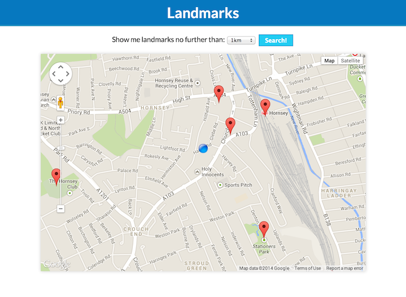

# Landmarks

This simple application shows all landmarks close to the user's position.

All functionality is written from scratch in vanilla JavaScript.

## Setup

This project requires a working installation of Ruby (>= 1.9).

Easy as:

    $ bundle
    $ cp env.sample .env

Then, update `.env` with a working Google Maps V3 Api key.

## Run the server

    $ bundle exec rackup
